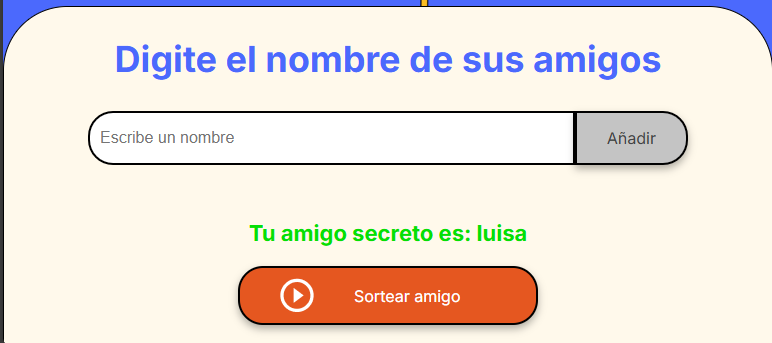

# amigo secreto
<h3>Funcionalidades</h3>
El proyecto cuenta con 3 funcionalidades principales que permiten el correcto funcionamiento del juego del amigo secreto

- Agregar amigo: Se encarga de que el jugador pueda agregar a los amigos que van a participar con solo presionar el botón de "Añadir". Si el jugador no ha digitado el nombre del amigo y presiona "Añadir" saldrá una alerta que indicará que es obligatorio digitar un nombre antes de añadirse al juego. Como se muestra en la siguiente imagen: 

- Mostrar amigos: Permite que los jugadores vean que amigos ya han sido agregados al juego, mostrandose en forma de lista, es decir, un jugador debajo del otro. Como se muestra en la imagen: 

- Sortear amigo: Es la encargada de sortear de forma eleatoria uno de los amigos que va a participar en el juego y asignandoselo a otro jugador. Como se muestra en la imagen:  Si ya no quedar participantes para sortear se mostrará un mensaje informandolo. como se muestra en la siguiente imagen: 